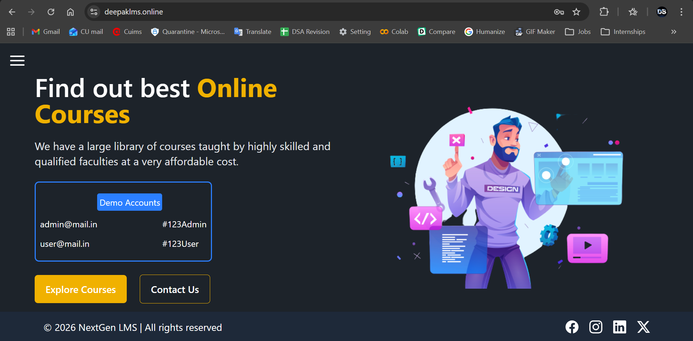
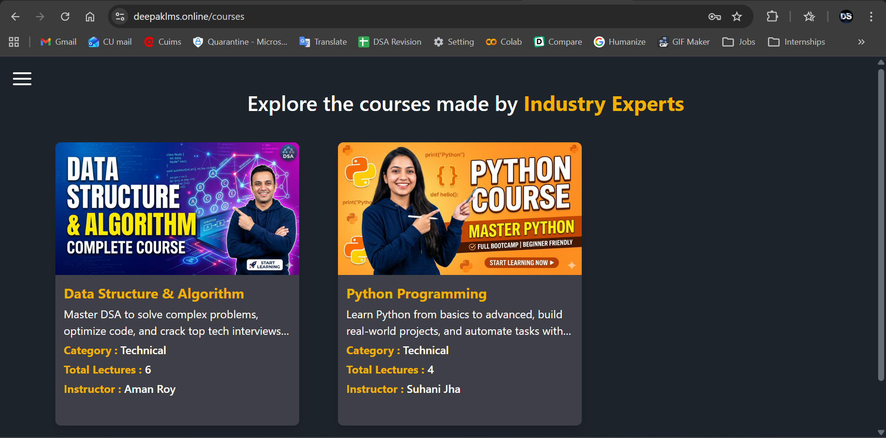
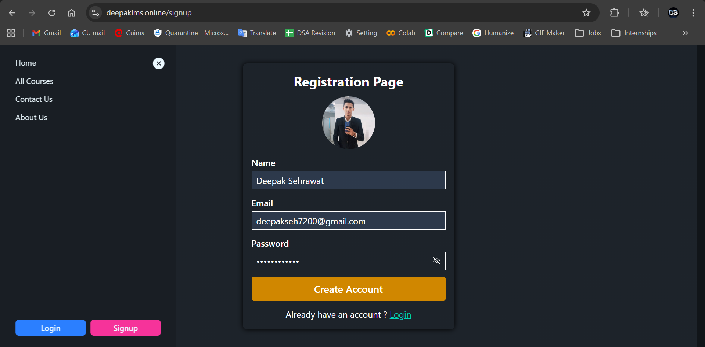
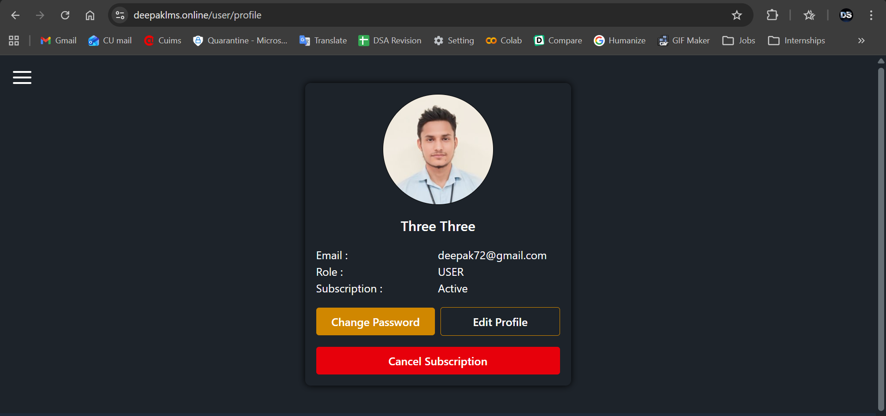
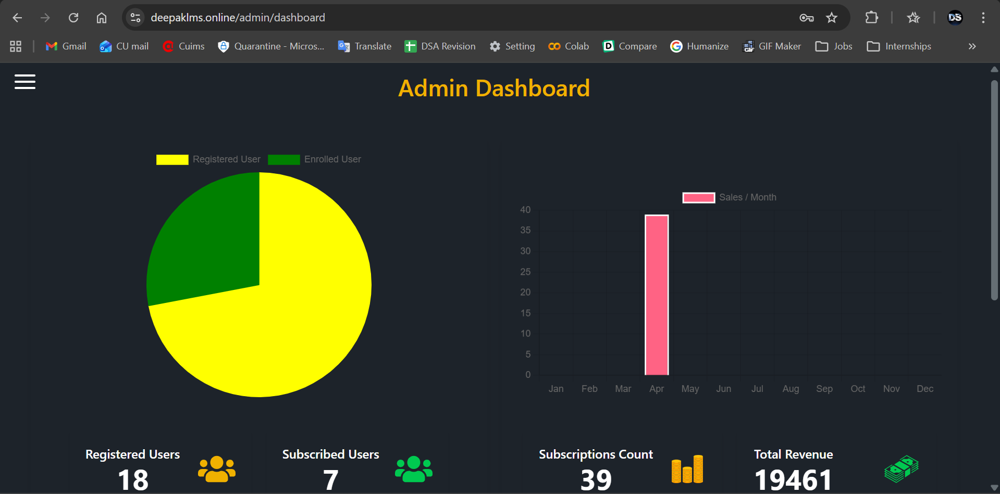

# 🎓 NextGen LMS

## 🚀 Features
- Browse courses
- Clean and responsive UI
- User-friendly navigation

## 🛠 Tech Stack
- React
- Tailwind
- JavaScript

## 🔗 Live Demo
https://www.deepaklms.online/

## 📸 Screenshots

### Home Page


### All Courses


### Signup Page


### Profile Page


### Checkout Page (User)
.png)

### Checkout Seccess (User)
.png)

### Admin Dashboard


### Display Lectures (Admin View)
.png)

## 📦 Installation
```bash
git clone https://github.com/Deepak7200/LMS-FrontEnd
cd NextGen-LMS
npm install
npm start
```

## 🤝 Contributing

Contributions are welcome, Feel free to fork the repo and submit a pull request.

---

## 📄 License

This project is open-source and available under the MIT License.

---

## 👨‍💻 Author

Deepak Singh Sehrawat
